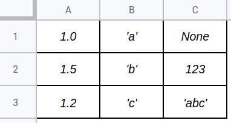

# Реализация **таблицы**.

В файле реализован класс и методы, которые описаны ниже. В функции `test()` приводятся примеры работы с классом.

Классс содержит краткую  документацию к реализуемым функциям. Форматирование кода соответствует codestyle.

## Таблица



Таблица представляет из себя структуру данных, хранящую в себе набор строк и наименования их элементов. Каждый элемент в списке имеет некоторое название — имя столбца. 


## `class Table`

### `__slots__`

Содержит атрибуты данного класса.

### `rows`

Атрибут экземпляра класса. Представляет из себя список строк таблицы. При создании таблицы инициализируется пустым списком.

Строка таблицы представляется в виде списка.

### `__init__(columns)`

Принимает один параметр:

* `columns` — список имен столбцов таблицы.

### `__str__`

Краткое строковое представление таблицы. Метод возвращает строку в следующем формате:

```
<Table with *columns*>
```

где вместо `*columns*` список столбцов таблицы.

Пример:

```
>>> str(table)
<Table with ['A', 'B', 'C']>
```

### `__repr__`

Полное строковое представление всей таблицы. Метод возвращает всю таблицу в виде строки следующего формата: первая строка — через пробел все имена столбцов, следующие строки — через пробел все значения строк таблицы.

Пример:

```
>>> repr(table)
A B C
1 2 3
4 5 6
```

### `__len__`

Возвращает количество строк в таблице.

### `__iter__`

Возвращает итератор следующего вида: при вызове `next` возвращается словарь, ключами которого являются имена столбцов, а значениями — соответствующие значения в очередной строке.

Пример:

```
>>> repr(table)
A B C
1 2 3
4 5 6
>>> next(table)
{'A': 1, 'B': 2, 'C': 3}
>>> next(table)
{'A': 4, 'B': 5, 'C': 6}
```

### `next_index`

Атрибут-свойство (`property`). Возвращает номер строки, который присвоится следующей добавленной строке.

Пример:

```
>>> repr(table)
A B C
1 2 3
4 5 6
>>> table.next_index
2
```

### `validate`

Метод, который проверяет соответствие строки требованиям (соответствие размеров: длина строки должна совпадать с количеством столбцов в таблице), иначе вызывается исключение `TableError`. Если совпадает — вернуть саму строку.

### `add_row`

Метод добавляет в таблицу строку. Строка перед добавлением валидируется. При успешном добавлении строки метод вернёт индекс добавленной строки.

### `get_row`

Метод возвращает строку с указанным индексом, иначе None.

### `remove_row`

Метод удаляет из таблицы строку с указанным индексом, либо ничего не происходит.

## `class TableError`

Класс исключения, вызываемого таблицей в методе `validate`.

